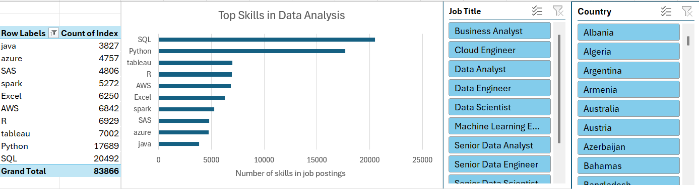
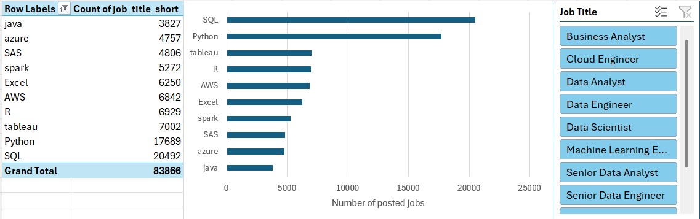
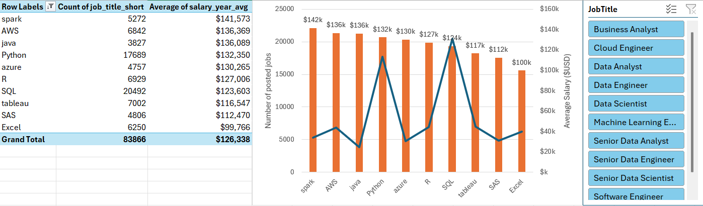
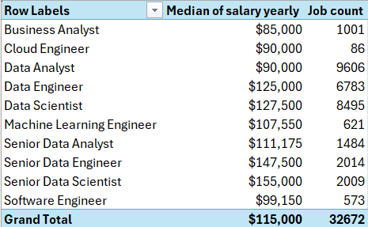
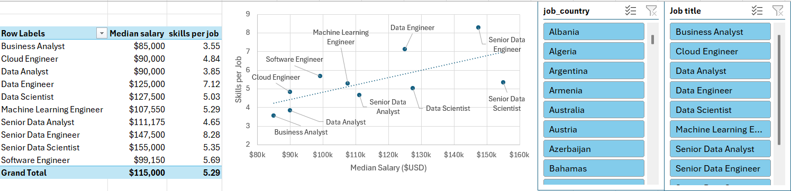
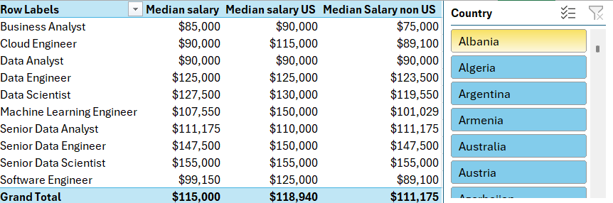
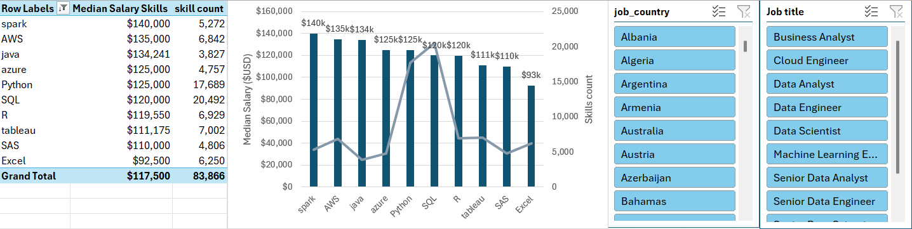

# Data Jobs Skills & Salary Analysis Dashboard

## Project Overview

This project is an interactive Excel analysis of data and technology job postings, with a focus on the relationship between job skills, salaries, job titles, and location.

The workbook combines Power Query, Power Pivot, DAX, PivotTables, slicers, and Excel charts to explore job-market patterns and salary differences across skills, job titles, and countries.

## Questions This Analysis Explores

The analysis explores the following questions:

- Which skills appear most frequently in job postings?
- How does salary vary by skill?
- How does salary vary across job titles?
- Is there a relationship between salary and the number of skills required per job?
- How do salaries differ between the United States and other countries?
- Which skills are associated with a selected job title?

These questions are addressed through the main dashboard and the supporting salary, skill, job-title, and country analyses.

## Main Dashboard

### Data Skills & Salary Analysis

The main dashboard combines skill-frequency analysis with interactive filters for job title and country.

The dashboard allows the user to explore the most frequently requested skills while changing the job title and country selections.

## Analysis Sheets

### 1. Power Query: Skill Count

This sheet contains a skill-count result generated using Power Query. It shows how frequently individual skills appear across job postings.

### 2. Power Query: Skill Salary Analysis

This analysis combines the number of job postings requiring each skill with the average salary associated with those postings.

### 3. Salary by Job Title

This analysis uses Power Pivot and DAX to compare median salary and job count across data and technology job titles.

### 4. Salary vs Skills

This analysis examines the relationship between median salary and the number of skills per job.

The scatter plot makes it possible to visually examine whether job titles requiring more skills tend to have different salary levels.

### 5. Salary by Country

This analysis compares median salary across all selected jobs, jobs in the United States, and jobs outside the United States.

### 6. Skills by Job Title

This analysis shows the skills associated with a selected job title, together with salary information and skill counts.

## Key Analysis Areas

### Skill Demand

The skill analysis shows the frequency of commonly requested technologies and tools. In the main dataset, SQL, Python, AWS, R, Tableau, Azure, Java, Spark, SAS, and Excel are among the skills represented in the analysis.

### Salary by Job Title

Median salary varies across job titles. The workbook allows these differences to be compared directly alongside job-posting counts.

### Salary and Number of Skills

The scatter plot compares median salary with the number of skills per job title. This provides a visual way to examine the relationship between the number of listed skills and salary.

### Geographic Comparison

The country analysis separates US and non-US postings so that salary differences can be explored without treating the global job market as a single group.

## Dataset

The underlying job-posting dataset contains 32,672 job postings across ten job-title categories.

The analysis includes fields related to:

- Job title
- Salary
- Country
- Job skills
- Job posting information
- Required technologies and tools

The skill-level analysis contains 83,866 skill occurrences across the analyzed job postings.

Salary calculations depend on the available salary records and exclude postings without usable salary information where applicable.

## Excel Techniques Used

This project demonstrates practical Excel data-analysis techniques including:

### Power Query

- Data transformation
- Skill extraction
- Grouping and aggregation
- Creating analysis tables

### Power Pivot and DAX

- Data modeling
- Measures
- Median salary calculations
- Job-count calculations
- Filter-aware analysis

### PivotTables and Slicers

- Interactive filtering
- Job-title filtering
- Country filtering
- Dynamic analysis by selected categories

### Data Visualization

- Horizontal bar charts
- Scatter plots
- Comparative salary tables
- Interactive dashboards
- Dynamic filtering

## Workbook Structure

| Sheet | Purpose |
|---|---|
| `PowerQuery_Skill_Count` | Skill-count analysis created with Power Query |
| `PowerQuery_Skill_Salary` | Skill frequency and average salary analysis |
| `Skills_Dashboard` | Main interactive skills dashboard |
| `Salary_by_Job_Title` | Median salary and job count by job title |
| `Salary_vs_Skills` | Relationship between salary and skills per job |
| `Salary_by_Country` | Salary comparison by country group |
| `Skills_by_Job_Title` | Skills and salary analysis for a selected job title |

## Skills Demonstrated

- Excel
- Power Query
- Power Pivot
- DAX
- PivotTables
- Slicers
- Data transformation
- Data modeling
- Salary analysis
- Skill analysis
- Data visualization
- Interactive dashboard development

## How to Use

1. Open the Excel workbook.
2. Go to `Skills_Dashboard`.
3. Use the Job Title and Country slicers to select the categories of interest.
4. Review the updated skill-frequency analysis.
5. Explore the other sheets for salary, skill, and job-title analysis.
6. Use the slicers on the relevant sheets to investigate different segments of the dataset.

## Project Goal

The goal of this project is to demonstrate how Excel can be used beyond basic spreadsheets to perform a complete data-analysis workflow, from data transformation and modeling to interactive analysis and visualization.

The project specifically demonstrates the use of Power Query, Power Pivot, DAX, PivotTables, and slicers to turn job-posting data into an interactive analytical tool.
