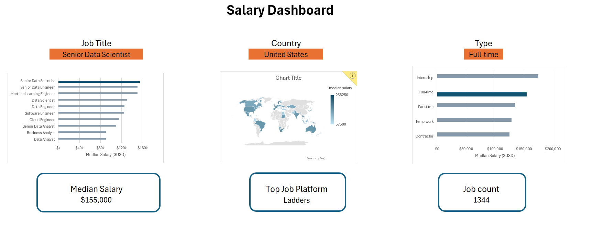

# Data Jobs Salary Dashboard

## Project Overview

This project is an interactive **Excel salary dashboard** built to explore job-market and salary patterns across data and technology roles.

Users can select a **job title**, **country**, and **job type**. The dashboard dynamically updates the KPIs and charts based on those selections. The selected job title and job type are also **highlighted in the corresponding bar charts**, making it easier to compare the chosen category with the rest of the market.

## Dashboard Preview

## Dashboard Features

The dashboard allows users to filter the analysis by:

- **Job Title**
- **Country**
- **Job Type**

The selected filters dynamically update:

- **Median Salary**
- **Top Job Platform**
- **Job Count**
- Salary comparison by job title
- Salary comparison by job type
- Country-level salary visualization

The selected **job title** and **job type** are visually highlighted in their respective bar charts so users can immediately identify the selected category.

## Example Dashboard View

The screenshot above shows the dashboard with:

- **Job Title:** Senior Data Scientist
- **Country:** United States
- **Job Type:** Full-time
- **Median Salary:** $155,000
- **Top Job Platform:** Ladders
- **Job Count:** 1,344

These values change dynamically when different filters are selected.

## Dataset

The workbook contains **32,672 job postings** with fields including:

- Job title
- Job location
- Job posting platform
- Job schedule type
- Work-from-home indicator
- Search location
- Posting date
- Degree requirement indicator
- Health insurance indicator
- Country
- Salary information
- Company
- Required skills

The dataset covers **111 countries** and multiple data and technology job categories.

> **Note:** The original data source is not specified in the workbook. The dataset description above is based on the fields contained in the Excel file.

## Questions This Analysis Explores

The dashboard was designed to answer questions such as:

- What is the median salary for a selected role, country, and job type?
- How does the selected role compare with other job titles?
- How do salaries vary across different employment types?
- Which job platform contains the most postings for the selected filters?
- How many matching job postings are available?
- How do salary levels vary geographically?

Salary calculations use the annual salary field and exclude records without valid annual salary information.

## Excel Techniques Used

This project demonstrates practical Excel data-analysis and dashboard skills, including:

- Excel Tables and structured references
- Dynamic array formulas
- `UNIQUE`
- `FILTER`
- `SORT`
- `XLOOKUP`
- `COUNTIFS`
- `MEDIAN`
- `IF`
- `SEARCH`
- Named ranges
- Dynamic chart ranges
- Conditional chart highlighting
- Interactive dashboard controls
- KPI cards
- Bar charts
- Geographic visualization

## Workbook Structure

| Sheet | Purpose |
|---|---|
| `Dashboard` | Main interactive dashboard |
| `Data` | Raw job-posting dataset |
| `Job_Schedule` | Salary analysis by employment type |
| `country` | Country-level salary analysis |
| `Job_title` | Job-title salary and job-count analysis |
| `platform` | Job-platform analysis |

## Skills Demonstrated

- Excel data analysis
- Data filtering and aggregation
- Dashboard development
- Dynamic formulas
- Salary and job-market analysis
- Data visualization
- Interactive chart design
- Conditional chart formatting
- Communicating insights through KPIs and visual comparisons

## How to Use

1. Download the Excel workbook.
2. Open the `Dashboard` worksheet in Microsoft Excel.
3. Select a **Job Title**, **Country**, and **Job Type**.
4. Review the updated KPIs and charts.
5. Compare the highlighted selection with the other categories.
6. Explore the supporting worksheets to see the calculations behind the dashboard.

## Project Goal

The goal of this project is to demonstrate how Excel can be used to transform a large job-posting dataset into an interactive dashboard that allows users to quickly explore salary levels, job availability, employment types, job platforms, and geographic patterns.
